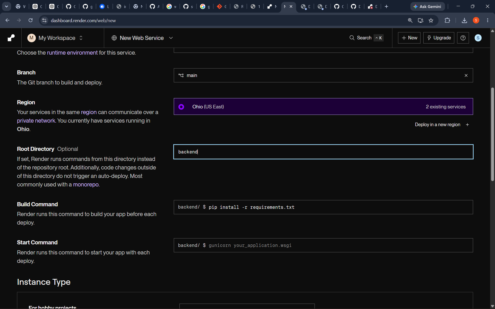
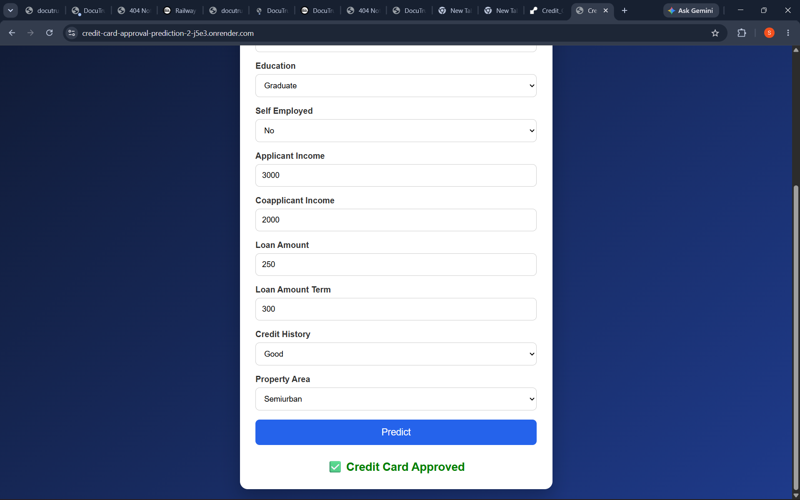
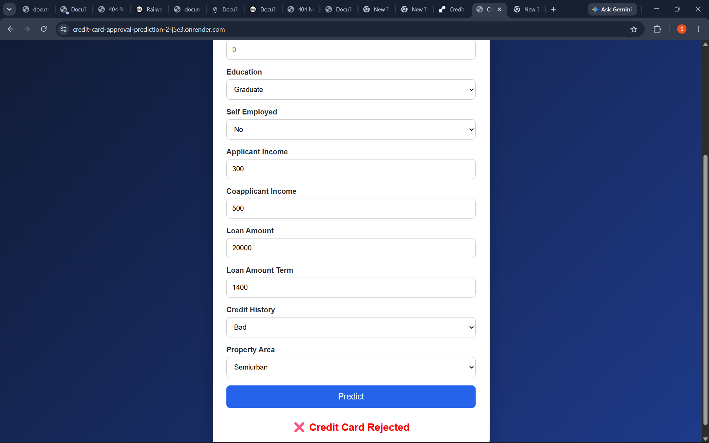

<<<<<<< HEAD
# 💳 Credit Card Approval Prediction using Machine Learning

A Flask-based Machine Learning web application that predicts whether a credit card/loan application will be **Approved** or **Rejected** based on applicant details.

---

## 🚀 Live Demo

🔗 **Render:** YOUR_RENDER_LINK

## 📂 GitHub Repository

🔗 YOUR_GITHUB_LINK

---

# 📌 Features

- ✅ Machine Learning Prediction
- ✅ Modern Responsive UI
- ✅ Approval / Rejection Result
- ✅ Flask Backend
- ✅ Trained ML Model
- ✅ Deployed on Render

---

# 🛠️ Technologies Used

- Python
- Flask
- HTML5
- CSS3
- JavaScript
- Pandas
- NumPy
- Scikit-learn
- Joblib
- Gunicorn
- Render

---

# 📁 Project Structure

```
Credit_Card_Approval_Prediction/
│
├── dataset/
│   └── loan_prediction.csv
│
├── model/
│   ├── model.pkl
│   └── encoders.pkl
│
├── static/
│   ├── css/
│   │   └── style.css
│   └── js/
│       └── script.js
│
├── templates/
│   └── index.html
│
├── app.py
├── train_model.py
├── requirements.txt
└── README.md
```

---

# 📸 Screenshots

## Home Page

(Add home.png here)

## Prediction Approved

(Add approved.png here)

## Prediction Rejected

(Add rejected.png here)

---

# ⚙️ Installation

Clone the repository

```bash
git clone YOUR_GITHUB_LINK
```

Go to project folder

```bash
cd Credit_Card_Approval_Prediction
```

Install packages

```bash
pip install -r requirements.txt
```

Run the application

```bash
python app.py
```

Open

```
http://127.0.0.1:5000
```

---

# 🤖 Machine Learning

The model predicts approval based on:

- Gender
- Married
- Dependents
- Education
- Self Employed
- Applicant Income
- Coapplicant Income
- Loan Amount
- Loan Amount Term
- Credit History
- Property Area

---

# 📈 Model Accuracy

**87.80%**

---

# 🌐 Deployment

The application is deployed using **Render**.

---

# 👨‍💻 Author

**Sunny**

GitHub: YOUR_GITHUB_LINK
=======
# Credit Card Approval Prediction

## Overview
This project predicts whether a credit card/loan application will be approved using Machine Learning.

## Technologies Used
- Python
- Flask
- HTML
- CSS
- JavaScript
- Scikit-learn
- Pandas

## Features
- Predict Approval/Rejection
- Responsive UI
- Machine Learning Model
- Live Deployment

## Project Structure
dataset/
model/
static/
templates/
app.py
train_model.py
requirements.txt

## Run Locally

pip install -r requirements.txt

python app.py

## Live Demo
Paste your Render URL here.

## GitHub Repository
Paste your GitHub URL here.
## Screenshots

### Home Page


### Approved Prediction


### Rejected Prediction

>>>>>>> 17754c7 (Added README, screenshots and documentation)
